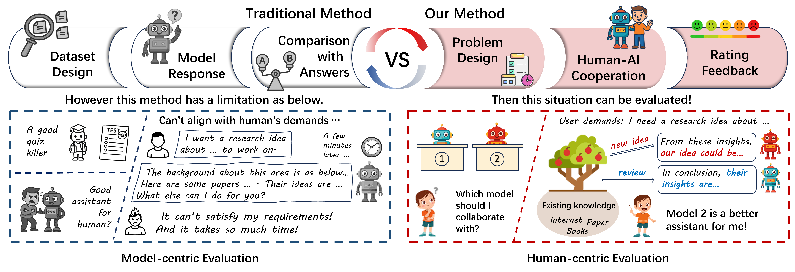
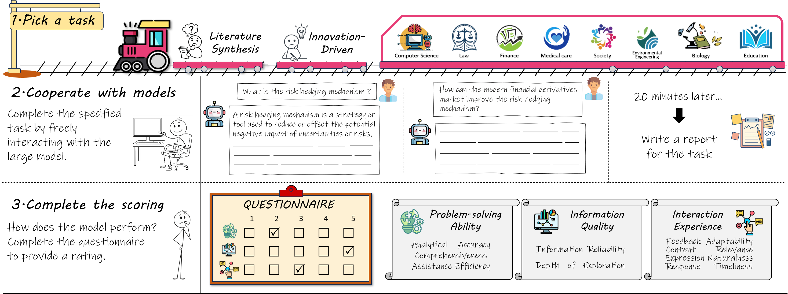
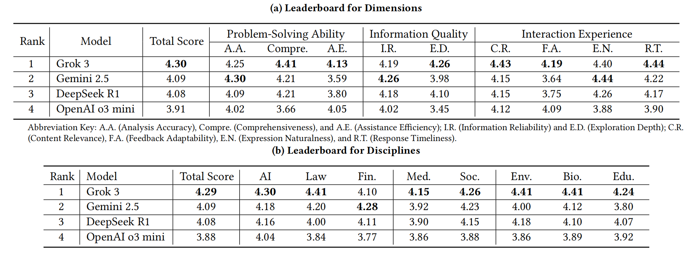
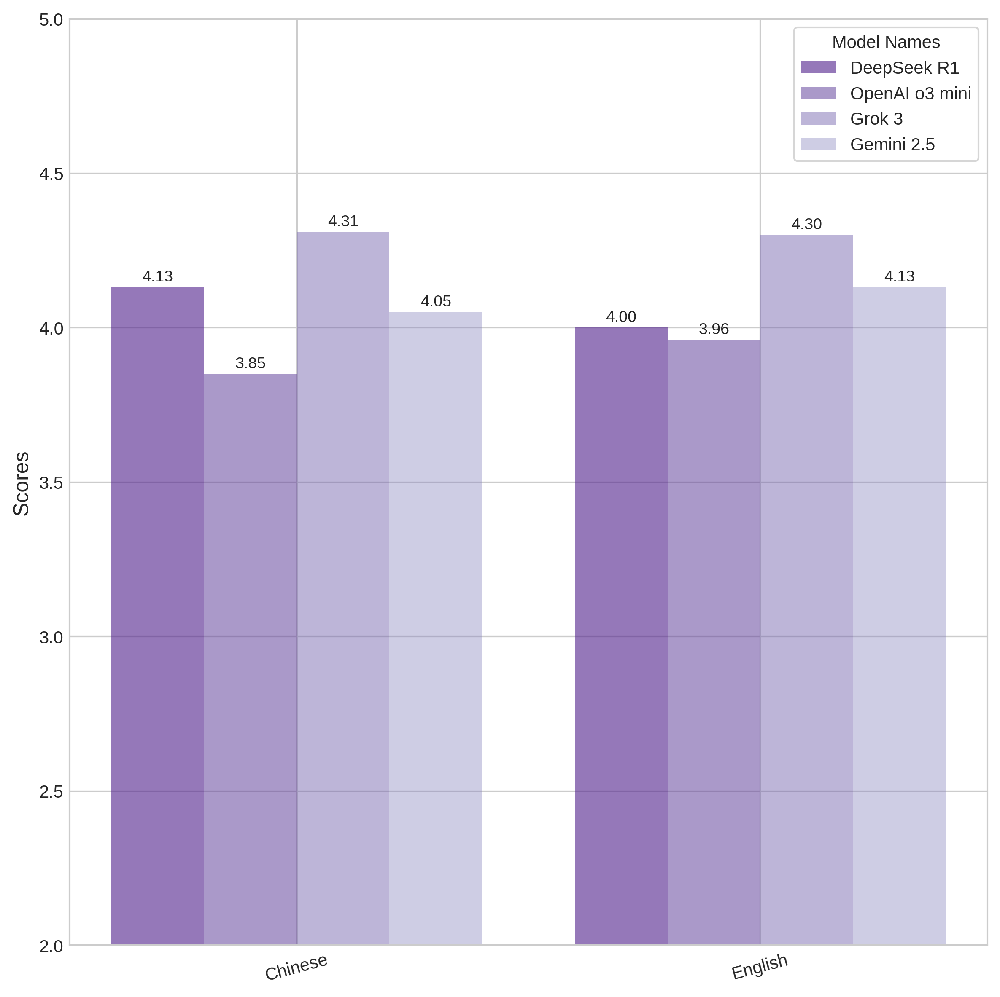
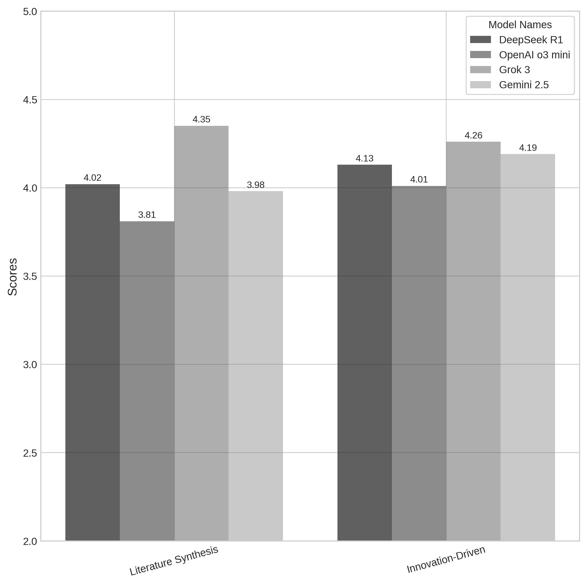
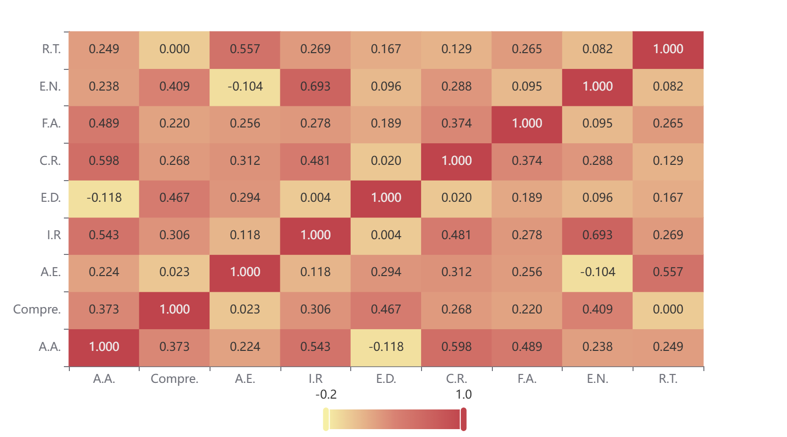
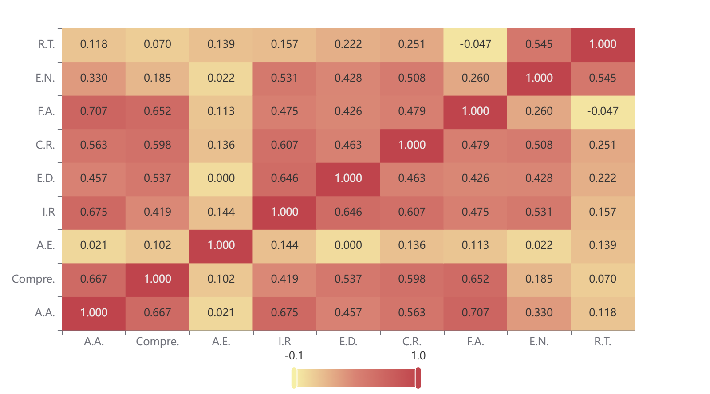
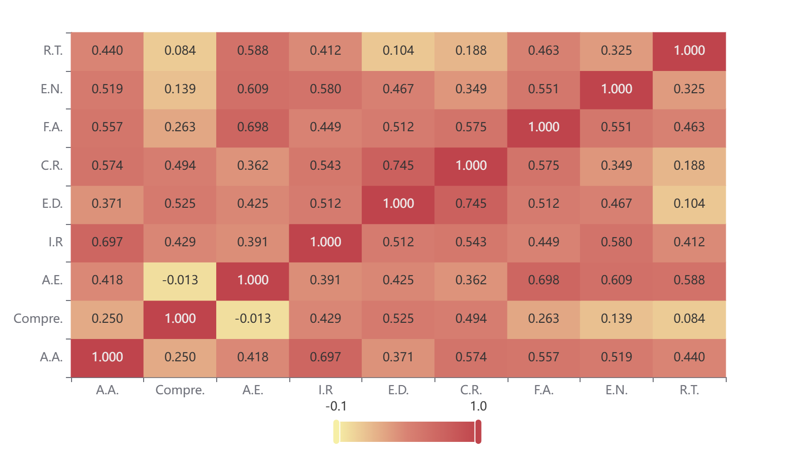

  

    
    
  

  <h1>Human-Centric Evaluation for Foundation Models</h1>
_Can foundation models satisfy people's demands?_
  

    <a href="https://yijinguo.github.io/" target="_blank">Yijin Guo</a>1,2,
    <a>Kaiyuan Ji</a>3,
    <a>Xiaorong Zhu</a>1,
    <a>Junying Wang</a>4,2,
    <a>Farong Wen</a>1,2  
  

  

    <a href="https://github.com/lcysyzxdxc" target="_blank">Chunyi Li</a>2,1,
    <a href="https://zzc-1998.github.io/" target="_blank">Zicheng Zhang</a>2,1#,
    <a href="https://ee.sjtu.edu.cn/en/FacultyDetail.aspx?id=24&infoid=153&flag=153" target="_blank">Guangtao Zhai</a>2,1#
  

  

    1Shanghai Jiaotong University,  2Shanghai AI Lab,
  

  

    3East China Normal University, 4Fudan University 
  
   
  

    #Corresponding author. 
  

  

    <a href="https://arxiv.org/abs/2506.01793"><strong>Paper</strong></a> | <a href="https://github.com/yijinguo/Human-Centric-Evaluation"><strong>Github</strong></a> | <a href="https://drive.google.com/drive/folders/1XO2BBDn-bQI-IYGISSOmRb6GFklNG7Vg?dmr=1&ec=wgc-drive-globalnav-goto"><strong>Data</strong></a>   
  

  

        
  

The traditional model-centric evaluation focuses on the quiz performance of foundation models, which is hard to reflect human experience. Therefore, we propose the **Human-Centric Evaluation** framework to better align the evaluation of foundation models with the quality of real human experience.

## Construction
  

        
  

Participants choose a task based on their major and interests, then interact freely with a foundation model for 20 minutes to complete it, and finally complete a questionnaire to assess the model's performance.

## Glance at HCE Results

Here are  the subjective leaderboard according to the experimental results. (a) showcases the detailed scores for each evaluation dimension across models, and (b) presents the scores for different disciplines.

    

    

        
        
Languages

    

    

        
        
Problem Type

    
  

## Statistic Analysis
We need to validate the rationality of the experimental design through statistical analysis. In our work, we use **Pearson correlation analysis** to verify the validity of the evaluation dimensions.
To conduct statistical analysis, we selected a small number of tasks and performed a large number of trials to obtain sample data for validating the experimental design. 
The Pearson correlation coefficient is calculated based on the covariance and standard deviations of two variables. Our results for Pearson Analysis are as below:

    

        
        
DeepSeek

    

    

        
        
OpenAI

    
  
    

        
        
Grok

    

